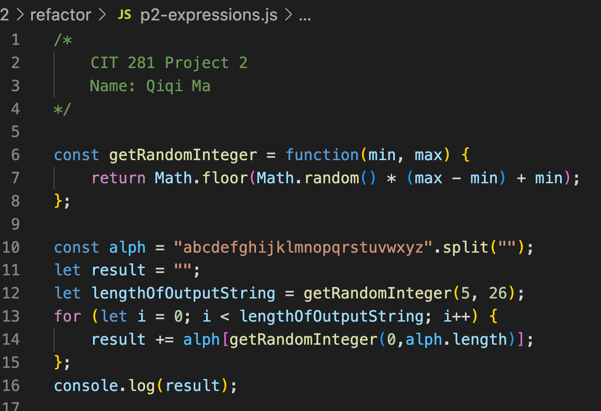

# cit281-project-2

[cit281-project-2](https://github.com/UO-CIT-qiqima/cit281-project-2)

Project 2:

1. I use the command line interface (CLI) of the operating system to create and work with a git repository (repo).
2. I refactor the JavaScript program from the previous project to practice using git and practice refactoring
3. I practice to use git via VSCode and create and use a .gitignore file

